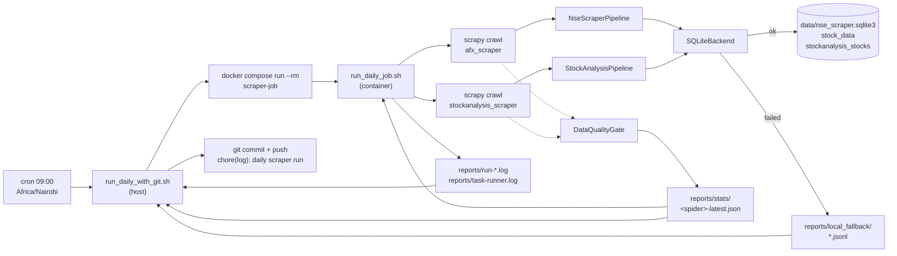
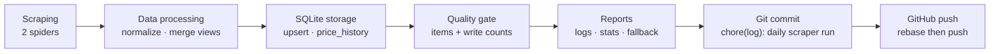
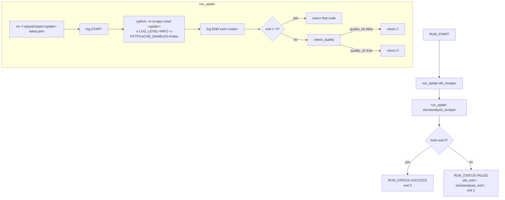
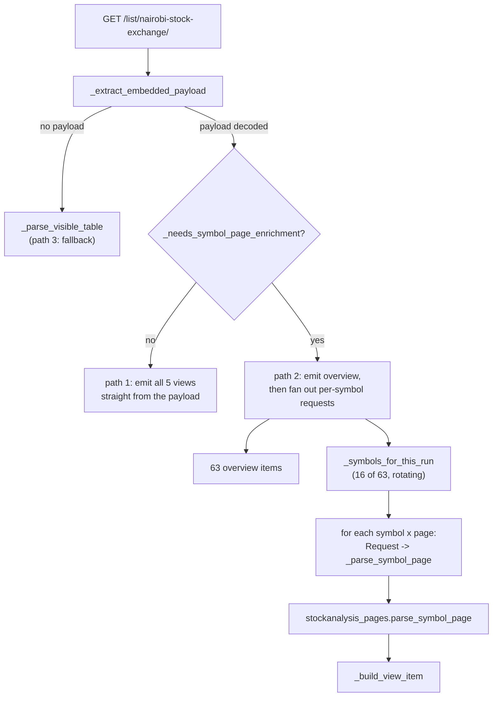
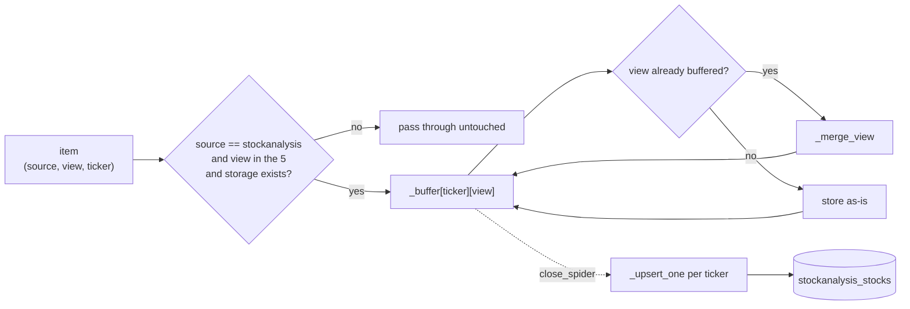
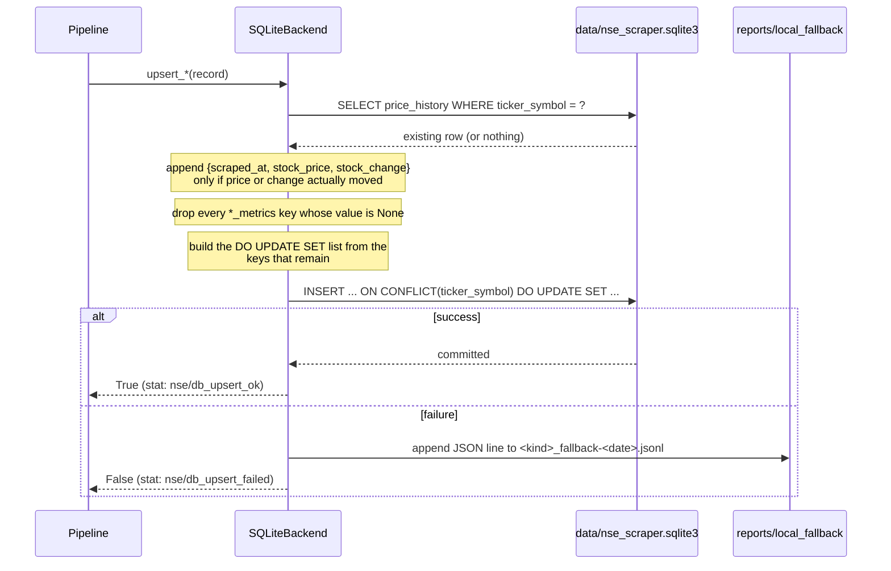

# Architecture and Data Flow

How a daily run works, end to end: from the cron line firing at 09:00 to a row landing in
SQLite and the verdict being committed back to git.

**Read this if** you need to trace where a value came from, change throttling or gating
behaviour, diagnose a `RUN_STATUS FAILED`, or understand why a design decision that looks
odd is deliberate. For setup see [Quickstart](QUICKSTART.md); for operational commands see
[Docker](DOCKER.md) and the [README](../README.md).

Every file reference below is `path:line` against the current tree.

> **Storage note.** As of 2026-09-06 the storage layer is a local SQLite database, not
> Supabase. Supabase remains selectable with `DB_BACKEND=supabase` but is no longer the
> default or the production target. See
> [MIGRATION_SUPABASE_TO_SQLITE.md](MIGRATION_SUPABASE_TO_SQLITE.md) for why and how.

---

## 1. System at a glance



Two independent crawls run in sequence inside one container. Neither writes files the
other reads; they are coupled only through the runner's exit-code arithmetic and through
the two mounted directories, `reports/` and `httpcache/`.

Seen as a data lifecycle rather than a call chain, the same run looks like this:



There are eight layers. Each section below covers one.

| # | Layer | Lives in |
|---|-------|----------|
| 1 | Scheduling | `deployment/cron/`, `scripts/install_daily_cron.sh` |
| 2 | Git publish wrapper | `scripts/run_daily_with_git.sh` |
| 3 | Container | `deployment/Dockerfile`, `deployment/docker-compose.yml` |
| 4 | Run orchestration | `scripts/run_daily_job.sh` |
| 5 | Scrapy engine + shared config | `nse_scraper/settings.py`, `nse_scraper/middlewares.py` |
| 6 | Spiders (extraction) | `nse_scraper/spiders/`, `nse_scraper/stockanalysis_pages.py` |
| 7 | Pipelines (shaping) | `nse_scraper/pipelines.py` |
| 8 | Storage | `nse_scraper/db/backends.py`, `sql/sqlite/` |

---

## 2. Layer 1 — Scheduling

The installed crontab entry (`deployment/cron/daily-cron.installed`):

```cron
CRON_TZ=Africa/Nairobi
0 09 * * * bash scripts/run_daily_with_git.sh
```

`scripts/install_daily_cron.sh` writes it. Two properties of that script matter:

**It only ever appends.** It reads the existing crontab, checks whether the command string
is already present, and re-installs the whole thing with its own two lines added. It never
replaces entries it did not write.

**`CRON_TZ` may be ignored.** `CRON_TZ` is a Vixie-cron extension. Every historical run has
fired at 09:00 *host-local* rather than 09:00 Nairobi, so the installer deliberately prints
both times (`scripts/install_daily_cron.sh:39-48`) and tells you to compare against the
first observed run in `reports/task-runner.log`. If the host is not on Nairobi time and the
entry fires at the wrong hour, change `CRON_HOUR` in the script rather than trusting
`CRON_TZ`.

### The crontab is not durable

Any other project running `crontab <file>` replaces the *entire* user crontab, silently
removing this entry. That happened on 2026-07-05 and no run occurred for the following
three weeks. `make cron-verify` greps the live crontab for the command and exits non-zero
if it is gone — run it after any crontab change made by another project.

---

## 3. Layer 2 — The git publish wrapper

`scripts/run_daily_with_git.sh` runs on the host, not in the container. It does three
things in order: run the job, commit the evidence, push it.

```
compose_run_cmd()  ->  docker compose -f deployment/docker-compose.yml run --rm scraper-job
                       (falls back to docker-compose if `docker compose` is unavailable)
                       stdout+stderr appended to reports/task-runner.log
                   ->  log DOCKER_RUN_STATUS SUCCESS|FAILED exit=<n>
```

Then it collects what to commit (`scripts/run_daily_with_git.sh:50-67`):

- the newest `reports/run-*.log` (only the newest — the run that just happened)
- `reports/task-runner.log`
- every `reports/local_fallback/*.jsonl`
- every `reports/stats/*.json`

Quality reports are committed alongside the logs on purpose: it makes item counts
queryable from git history, which is what makes a slow degradation visible months later.

Commit message is `chore(log): daily scraper run <YYYY-MM-DD> - <SUCCESS|FAILED>` — so
`git log --oneline` is itself a run history.

Publishing is `git pull --rebase --autostash origin <branch>` and then `git push`. The
rebase-first step exists because origin may have moved (CI, or a manual commit), and a
plain push would be rejected as non-fast-forward. On rebase conflict it runs
`git rebase --abort` so the working tree is never left mid-rebase for the next day's run
to trip over.

**Exit-code precedence** (`scripts/run_daily_with_git.sh:119-123`): a scrape failure
outranks a publishing failure, but neither may exit 0. The scrape's exit code wins if it
was non-zero; otherwise the git exit code is returned.

**A FAILED run still commits.** That is deliberate — the failure evidence is exactly what
you want in git.

Flags: `--no-git-push` (commit locally only), `--no-git-commit` (implies no push).
Both are also readable from the `NO_GIT_PUSH` / `NO_GIT_COMMIT` environment variables.

---

## 4. Layer 3 — The container

`deployment/docker-compose.yml` defines a single one-shot service:

```yaml
services:
  scraper-job:
    build: { context: .., dockerfile: deployment/Dockerfile }
    env_file: [ ../.env ]
    environment:
      DB_BACKEND: sqlite          # forced, regardless of .env
      SQLITE_DB_PATH: /app/data/nse_scraper.sqlite3
    volumes:
      - ../reports:/app/reports   # logs, stats, fallback JSONL escape the container
      - ../httpcache:/app/httpcache
      - ../data:/app/data         # the database escapes the container
    entrypoint: ["bash", "scripts/run_daily_job.sh"]
```

The image's own `ENTRYPOINT` is `python -m scrapy` with `CMD ["crawl", "afx_scraper"]`
(`deployment/Dockerfile:48-49`) — useful for ad-hoc single crawls. Compose overrides it so
the daily job runs the full two-spider sequence with quality gating instead.

Both bind mounts are load-bearing. Without `../reports`, the run log, the quality reports
and the fallback JSONL would die with the container and the host wrapper would have nothing
to commit. Without `../data`, the SQLite database would be destroyed on every `--rm` and
each day would start from an empty table.

The host directories must exist before the first run: Docker creates a missing bind-mount
source as `root`, and the container runs as uid 1000, so it would then fail to write.
`reports/.gitkeep` and `data/.gitkeep` are committed for exactly this reason.

The image is a multi-stage `python:3.14-slim` build that runs as a non-root `scraper` user.
Its `HEALTHCHECK` validates whichever backend is selected — for `sqlite`, that the database
directory is writable; for `supabase`, that both credentials are set. A config check, not a
liveness check, but one that catches a missing or read-only `../data` mount before a crawl
sends 63 rows to the fallback file instead of the database.

---

## 5. Layer 4 — The runner script

`scripts/run_daily_job.sh` is where the actual sequencing lives.



Three details are easy to miss:

**The stale report is deleted before the crawl** (`scripts/run_daily_job.sh:61`). If the
crawl crashes hard enough never to write a new report, `check_quality` finds no file and
reports `QUALITY <spider> MISSING`. Without the delete, yesterday's verdict would be
re-read and a dead crawl would report healthy.

**`check_quality` shells out to Python** (`scripts/run_daily_job.sh:24-54`) to read
`reports/stats/<spider>-latest.json` and exit on its `quality_ok` flag. This exists because
**Scrapy exits 0 even when a spider scrapes nothing.** The exit code alone cannot
distinguish a healthy run from a silently empty one, so the item count is checked
explicitly. See [§13](#13-quality-gate-and-observability).

**Caching is disabled for both crawls** via `-s HTTPCACHE_ENABLED=False`. `settings.py`
enables a 1-hour filesystem cache for interactive development, but the daily run must
measure a live fetch or the quality gate would be grading a replay.

### Exit codes and log vocabulary

| Code | Meaning |
|------|---------|
| 0 | crawl succeeded and passed the quality gate |
| 2 | crawl exited 0 but the gate failed (too few items, or every DB write failed) |
| other | Scrapy's own exit code |

Grep-able markers, in the order they appear:

| Marker | Written by | Meaning |
|--------|-----------|---------|
| `RUN_START` | runner | container job started |
| `START <spider>` / `END <spider> exit=<n>` | runner | one crawl's boundaries |
| `QUALITY <spider> OK\|FAILED\|MISSING ...` | runner | gate verdict with item and DB counts |
| `RUN_STATUS SUCCESS\|FAILED` | runner | overall job verdict |
| `DOCKER_RUN_STATUS SUCCESS\|FAILED exit=<n>` | wrapper | container exit |
| `GIT_COMMIT_STATUS` / `GIT_PUSH_STATUS` / `GIT_NO_CHANGES` | wrapper | publish outcome |

`RUN_*` and `QUALITY` lines go to both `reports/run-<stamp>.log` and
`reports/task-runner.log`; `DOCKER_*` and `GIT_*` only to `task-runner.log`.

---

## 6. Layer 5 — Scrapy engine and shared configuration

`nse_scraper/settings.py` loads `.env` via `python-dotenv` at import and registers three
components globally:

```python
ITEM_PIPELINES        = {'nse_scraper.pipelines.NseScraperPipeline': 300}
EXTENSIONS            = {'nse_scraper.extensions.DataQualityGate': 500}
DOWNLOADER_MIDDLEWARES = {'nse_scraper.middlewares.NseScraperDownloaderMiddleware': 543}
```

> **Gotcha:** `stockanalysis_scraper` replaces `ITEM_PIPELINES` wholesale in its
> `custom_settings`, so `NseScraperPipeline` **never runs for that spider**. See
> [§9](#9-layer-7--pipelines).

### Settings that carry a reason

| Setting | Value | Why |
|---------|-------|-----|
| `DOWNLOAD_TIMEOUT` | 30 (env-tunable) | Scrapy's default of 180s meant an unreachable host burned ~9 minutes per run across retries |
| `HTTPCACHE_ENABLED` | `True`, 1h | convenience for local iteration; the daily runner turns it off |
| `ROBOTSTXT_OBEY` | `False` | both targets serve data behind permissive-but-unhelpful robots rules |
| `CONCURRENT_REQUESTS` / per domain | 8 / 2 | project-wide default; `stockanalysis_scraper` tightens it to 1 |
| `DOWNLOAD_DELAY` | 1 | ditto — the stockanalysis spider raises it to 2 |
| `AUTOTHROTTLE_*` | on, 1–20s, target concurrency 1.0 | adapts to server response time now that runs fetch several pages per ticker |
| `RETRY_TIMES` / `RETRY_HTTP_CODES` | 3 / `[500,502,503,504,408,429]` | note the absence of 403, everywhere |
| `MIN_ITEMS_*` | `0` by default | so CI and ad-hoc runs never fail the gate; `.env` sets the real values |
| `USER_AGENT` | full Chrome 120 string | a spider-level override once shadowed this with a truncated UA missing the Chrome/Safari tokens |

Real thresholds live in `.env`: `MIN_ITEMS_STOCKANALYSIS_SCRAPER=95`,
`MIN_ITEMS_AFX_SCRAPER=0` (afx is currently down, so its gate is switched off rather than
failing the job every day).

### Downloader middleware

`NseScraperDownloaderMiddleware` (`nse_scraper/middlewares.py:59`) does exactly one thing:
per-spider proxy injection. `PROXY_SETTING_BY_SPIDER` maps `afx_scraper` →
`AFX_PROXY_URL`; `process_request` sets `request.meta['proxy']` only for a spider in that
map and only when the setting is non-empty. With `AFX_PROXY_URL` unset the middleware is a
no-op and `stockanalysis_scraper` is never affected.

`NseScraperSpiderMiddleware` in the same file is the unmodified Scrapy scaffold and is
**not registered** in `settings.py`.

---

## 7. Layer 6a — `afx_scraper`

The simple one: a single request, a single table, flat items.

```
GET https://afx.kwayisi.org/nse/
  -> response.css('table tbody tr')
     -> td[1] ticker  td[2] name  td[4] price  td[5] change
        -> _clean_text / _clean_price
           -> yield dict
```

`nse_scraper/spiders/afx_scraper.py:18` `parse()` iterates rows, pulls four cells by
XPath position, and cleans them. `_clean_price` (`:71`) strips every character that is not
a digit or a decimal point before `float()` — which also strips a leading minus sign, so a
negative change is stored as its absolute value.

Rows missing a ticker, a name, or a price are skipped with a debug log rather than yielded.
Row-level and page-level exceptions are both caught and logged, so one bad row cannot end
the crawl.

Emitted item shape (a plain dict, not the `NseScraperItem` in `nse_scraper/items.py` —
that class exists and is tested but is not what the spider yields):

| Field | Type | Source |
|-------|------|--------|
| `ticker_symbol` | str | `td[1]` |
| `stock_name` | str | `td[2]` |
| `stock_price` | float | `td[4]` |
| `stock_change` | float \| None | `td[5]` |
| `scraped_at` | datetime (UTC) | `datetime.now` |
| `created_at` | datetime (UTC) | same value |

> **Currently returns 0 items.** `afx.kwayisi.org` refuses connections from the production
> host on every one of its addresses. Set `AFX_PROXY_URL=http://host:port` to route only
> this spider through a proxy, then raise `MIN_ITEMS_AFX_SCRAPER` to ~40 to re-enable its
> gate.

---

## 8. Layer 6b — `stockanalysis_scraper`

The complex one. It has three parse paths, a rotating work window, and throttling settings
that exist because of a specific incident.

### 8.1 Three paths through `parse()`

`nse_scraper/spiders/stockanalysis_scraper.py:111`



**Path 1 — embedded payload.** The list page is a SvelteKit app whose `kit.start(...)`
script carries the whole table as JS object literals. `_extract_embedded_payload` (`:228`)
finds the script containing both `stockData:[` and `initialDynamicViews:` and regexes out
three objects: `stockData` (the rows), `initialDynamicViews` (which column ids belong to
which tab), and `stockQuery`.

That text is JS, not JSON, so `_loads_js_like` (`:402`) repairs it before `json.loads`:

| Repair | Example |
|--------|---------|
| `void 0` → `null` | `x:void 0` |
| `undefined` → `null` | `x:undefined` |
| leading-dot floats | `.75` → `0.75`, `-.75` → `-0.75` |
| unquoted keys | `{price:1}` → `{"price":1}` |
| trailing commas | `[1,2,]` → `[1,2]` |

`_view_map_from_payload` (`:377`) then slugs the site's view names and force-overlays the
five views this project cares about from `_TARGET_VIEW_COLUMNS` (`:73`) — overview is
always overwritten with the full unlocked column list; the rest are only defaults.

**Path 2 — per-symbol enrichment (what runs today).** `_needs_symbol_page_enrichment`
(`:273`) checks whether *any* row has *any* non-empty value for each view's metric columns.
The `api.stockanalysis.com/api/screener/*` endpoints that used to populate performance,
dividends, price and profile were retired and return 404 for every variant, so today four
views come back empty and this returns `True`.

When it does, the spider:

1. **Emits all 63 overview items first**, straight from the embedded payload
   (`:137-163`). This is why partial data still lands even if every per-symbol request
   fails.
2. Picks this run's slice with `_symbols_for_this_run` and fans out one `Request` per
   (symbol × page) with `cb_kwargs={symbol, page, base, scraped_at}` carrying the
   list-page row along as `base`.

Failures are counted, not raised: `_handle_symbol_page_error` (`:342`) bumps
`stockanalysis/symbol_page_failed`, and a page that parses to nothing bumps
`stockanalysis/empty_page/<page>` (`:334`).

**Path 3 — visible table.** `_parse_visible_table` (`:412`) reads `#main-table` directly,
keying columns off `<th id>` attributes. Only reached when the embedded payload cannot be
decoded at all.

### 8.2 The rotating window

`_symbols_for_this_run` (`:297`) picks `STOCKANALYSIS_MAX_SYMBOLS` (default 16) symbols per
run:

```python
start = (datetime.now(timezone.utc).date().toordinal() * self._MAX_SYMBOLS) % len(symbols)
selected = (symbols[start:] + symbols[:start])[:self._MAX_SYMBOLS]
```

Keying on the ordinal date means consecutive days pick up where the previous run left off,
while a re-run on the same day *repeats* rather than skips — so a failed run can be retried
without punching a hole in coverage.

Worked example, 2026-09-06 with 63 symbols:
`date(2026,9,6).toordinal() = 739865`; `739865 * 16 % 63 = 14`. The window starts at index
14, so `DTK` (rank 15) is the first symbol enriched that day — and indeed `DTK` is one of
the rows carrying full `dividends_metrics` and `profile_metrics` in that day's output.

At 16 symbols the full catalogue is refreshed roughly every 4 days. Setting
`STOCKANALYSIS_MAX_SYMBOLS=0` disables the cap and enriches everything in one run.

This suits the data: dividends, profile and the 52-week range move slowly, while `price`
and `change` still refresh **daily for every ticker** from the single list-page request.

### 8.3 Why the throttling is what it is

`custom_settings` (`:40-54`) overrides the project defaults for this spider only:

```python
"CONCURRENT_REQUESTS_PER_DOMAIN": 1,
"DOWNLOAD_DELAY": 2,              # STOCKANALYSIS_DOWNLOAD_DELAY
"RANDOMIZE_DOWNLOAD_DELAY": True,
"AUTOTHROTTLE_ENABLED": True, "AUTOTHROTTLE_START_DELAY": 2, "AUTOTHROTTLE_MAX_DELAY": 15,
"RETRY_HTTP_CODES": [500, 502, 503, 504, 408, 429],   # note: no 403
"RETRY_TIMES": 2,
```

**The incident:** a full-catalogue run of 126 requests drew **353 × 403** against only 36
successes, wasting 16 minutes and deepening the block. Three rules follow, and changing any
of them brings the blocking back:

1. **403 is never retried.** It signals an active rate limit; retrying multiplies requests.
2. **Each run enriches a slice, not the catalogue** — ~32 requests instead of 126.
3. **Requests go one at a time** with a 2s randomized floor and autothrottle on top.

If 403s reappear, lower `STOCKANALYSIS_MAX_SYMBOLS` or raise `STOCKANALYSIS_DOWNLOAD_DELAY`.

### 8.4 Per-symbol page parsing

`nse_scraper/stockanalysis_pages.py` holds pure functions: HTML plus the spider's
normalizer in, `{view_name: {column_id: value}}` out. Nothing here touches the network or
the database, which is why it is the most heavily unit-tested module in the repo
(`tests/test_stockanalysis_pages.py`).

URLs are built by `symbol_page_url(symbol, page, exchange="nase")` (`:53`) →
`https://stockanalysis.com/quote/nase/<SYMBOL>/<suffix>`.

`extract_js_object` (`:61`) is a brace-depth, string-aware scanner rather than a regex,
because a non-greedy regex stops at the first `}` and truncates nested objects like
`profile:{industry:{value:...}}`.

Values come from structured JS objects wherever possible; only the 52-week range and
volume are read from visible markup, and those are keyed on **label text**
(`label_value_pairs`, `:114`) rather than on Tailwind classes, which churn between deploys.

| Page | Fetched by default | Function | Views produced |
|------|-------------------|----------|----------------|
| `quote` (`/`) | yes | `parse_quote_page:161` | `price`, `performance`, `profile` |
| `dividend` (`/dividend/`) | yes | `parse_dividend_page:217` | `dividends` |
| `company` (`/company/`) | **no** | `parse_company_page:236` | `profile` |

The company page is excluded from `DEFAULT_SYMBOL_PAGES` (`:43`) because the quote page's
own `infoTable` already carries industry / founded / employees; including it would add a
third more requests to gain only `country`. Re-enable with
`STOCKANALYSIS_SYMBOL_PAGES=quote,dividend,company`.

**This overlap is why the pipeline needs a merge step** — `profile` can be assembled from
two different pages arriving in either order. See [§9.2](#92-stockanalysispipeline).

### 8.5 View → field reference

| View | Field | Source | Notes |
|------|-------|--------|-------|
| `overview` | `marketCap`, `revenue` | list-page payload | populated |
| | `volume`, `industry`, `sector`, `revenueGrowth`, `netIncome`, `fcf`, `netCash` | list-page payload | **currently null** — not served for NSE tickers |
| `performance` | `tr1y` | quote page `ch1y`, else "52-Week Price Change" | the only horizon published |
| | `tr1m`, `tr6m`, `trYTD`, `tr5y`, `tr10y` | — | **unavailable**; omitted, not nulled |
| `dividends` | `dps` | `infoTable.annual`, currency stripped | |
| | `dividendYield`, `dividendGrowth`, `payoutRatio` | `infoTable` | percentages → float |
| | `exDivDate`, `payoutFrequency` | `infoTable` | kept as strings |
| `price` | `volume`, `low52`, `high52` | quote page label rows | |
| | `low52ch`, `high52ch` | **computed** by `_percent_change:149` | move from the 52-week bound to the current price, 2dp |
| `profile` | `industry`, `founded`, `employees` | quote page `infoTable` | |
| | `country` | company page only | absent unless `company` is enabled |

### 8.6 Value normalization

`_normalize_metric_value` (`:476`) is applied to every metric, and each item carries
**both** the raw and normalized forms as `metrics_raw` and `metrics`:

| Input | Output |
|-------|--------|
| `"4.67%"` | `4.67` |
| `"1.51T"` | `1510000000000.0` |
| `"700,079"` | `700079` |
| `""`, `"-"`, `"--"`, `"n/a"`, `"null"`, `"none"` | `None` |
| `"Commercial Banks"` | `"Commercial Banks"` (passthrough) |
| `1946` | `1946` (numbers pass through untouched) |

The pipeline stores `metrics_raw`, falling back to `metrics` if it is empty
(`nse_scraper/pipelines.py:178`). Because the list-page payload already contains real
numbers, `metrics_raw` is numeric there too — the raw/normalized distinction matters mostly
on the HTML-scraped pages, where `metrics_raw` holds what `stockanalysis_pages` returned
(itself already normalized, since those parsers call the normalizer directly).

---

## 9. Layer 7 — Pipelines

Two pipelines exist and **they never run together**. Which one is active depends on the
spider.

```python
# nse_scraper/spiders/stockanalysis_scraper.py:16
def _stockanalysis_pipelines():
    if os.getenv("DB_BACKEND", "sqlite").strip().lower() in SUPPORTED_BACKENDS:
        return {"nse_scraper.pipelines.StockAnalysisPipeline": 300}
    return {}
```

That dict is assigned to `custom_settings["ITEM_PIPELINES"]`, which **replaces** rather
than merges with the global setting. So:

| Spider | Active pipeline | Table |
|--------|----------------|-------|
| `afx_scraper` | `NseScraperPipeline` (from `settings.py`) | `stock_data` |
| `stockanalysis_scraper` | `StockAnalysisPipeline` only | `stockanalysis_stocks` |
| `stockanalysis_scraper` with an unsupported `DB_BACKEND` | **none** — items are discarded | — |

Note also that `_stockanalysis_pipelines()` reads `os.getenv` at **class-definition time**,
not from Scrapy settings — so `-s DB_BACKEND=...` on the command line will not change which
pipeline is installed; the environment variable will.

### 9.1 `NseScraperPipeline`

`nse_scraper/pipelines.py:13`. Straightforward, one write per item:

1. `from_crawler` reads backend config from settings and keeps `crawler.stats` so writes
   can be counted for the quality gate.
2. `open_spider` constructs and opens the backend.
3. `process_item` validates `ticker_symbol`, `stock_name` and `stock_price` — any missing
   one raises `DropItem` — converts the item to a dict, and calls
   `storage.upsert_stock(data)`.
4. The boolean result increments `nse/db_upsert_ok` or `nse/db_upsert_failed`.

Any non-`DropItem` exception is caught, logged with a traceback, and re-raised as
`DropItem`, so a single bad row cannot abort the crawl.

### 9.2 `StockAnalysisPipeline`

`nse_scraper/pipelines.py:91`. This one **buffers everything and flushes at the end**.



**Why buffer until `close_spider` rather than flush when all five views arrive?** Views now
come from separate per-symbol pages with no guaranteed arrival order. An eager flush would
write a record, and then a straggling view would arrive and re-upsert a *thinner* record
over it. Buffering to the end means exactly one write per ticker, with everything that
arrived.

**`_merge_view`** (`:217`) combines two items for the same view. It merges `metrics_raw`
and `metrics` key by key, and a `None` never overwrites a populated value. This exists
because `profile` can be assembled from both the quote page and the company page.

**`_upsert_one`** (`:151`) flattens the buffered views into one record:

- common fields (`company_name`, `rank`, `stock_price`, `stock_change`, `scraped_at`) are
  taken from the `overview` view, falling back to whichever view is available
- each view's metrics become one `<view>_metrics` blob
- `price` and `change` are **stripped out of** `overview_metrics` and `price_metrics`,
  because they are already first-class columns

A write failure here is caught, counted as a failed write, and logged — it does not stop
the remaining tickers from being flushed.

---

## 10. Layer 8 — Storage

`nse_scraper/db/backends.py`. `create_backend` accepts the names in `SUPPORTED_BACKENDS`
— `sqlite` (default) and `supabase`. Anything else raises.

| Backend | Class | Target | Selected by |
|---|---|---|---|
| `sqlite` | `SQLiteBackend` | `data/nse_scraper.sqlite3` | `DB_BACKEND=sqlite` (default) |
| `supabase` | `SupabaseBackend` | PostgREST | `DB_BACKEND=supabase` |

Both subclass `_BaseBackend`, which owns the two storage-agnostic behaviours — the JSONL
fallback and the price-history append rule — so they cannot drift apart.

> Mongo and Postgres appear in `.env` comments and in `nse_scraper/db/models.py` +
> `alembic/` — **none of that is wired into the runtime.** The SQLAlchemy model and the
> Alembic environment are vestigial; the live schema is `sql/sqlite/001_schema.sql`, which
> `SQLiteBackend._create_schema()` issues on every `open()`. The `sql/0*.sql` files are the
> Supabase-era DDL, kept as the historical record.

### 10.1 Both upserts are read-modify-write

`upsert_stock` and `upsert_stockanalysis_stock` follow the same shape:



Three consequences worth knowing:

**One local transaction per row, not two network round-trips.** Under Supabase a 63-row run
meant ~126 PostgREST calls over the internet; the same run is now 63 local transactions.
The SELECT still exists, to read `price_history` back so it can be appended to in Python.

**History is deduplicated by value, not by time.** A new entry is appended only when the
price or change differs from the last entry (`_extend_price_history`). A ticker that does
not move for a week gets one entry, not seven — so `price_history` is a change log, not a
daily series, and gaps in it mean "unchanged", not "not scraped".

**A `None` metric is dropped from the payload, not written**:

```python
for metrics_key in METRICS_COLUMNS:
    if payload[metrics_key] is None:
        del payload[metrics_key]
```

A column absent from the payload appears in neither the INSERT nor the `DO UPDATE SET`, so
it keeps whatever was stored last run; writing `None` would set SQL `NULL` and blank it.
This is the fix for a real bug: the four views lost to the retired screener API were being
**blanked on every run** because the pipeline sent `None` for them. Combined with the
rotating window, it is what lets a ticker keep last week's dividend data on a day when it
was not enriched.

Under Supabase the omission happened implicitly — PostgREST generated the UPDATE clause
from the payload keys. In SQLite the SQL is ours, so `_upsert` assembles the `SET` list
from the keys actually present. That is the single highest-risk line of the migration and
`tests/test_sqlite_backend.py` locks it in with a real round-trip.

### 10.2 The local fallback

`_write_local_fallback` (`:84`) appends the exact payload that failed, as one JSON object
per line, to:

```
reports/local_fallback/<stock_data|stockanalysis_stocks>_fallback-<YYYY-MM-DD>.jsonl
```

These files are committed to git by the wrapper, so nothing is lost when storage is
unavailable — the data is replayable. It also means a crawl can look completely healthy
while nothing reached the database, which is precisely the case the quality gate checks for.

The fallback was **kept** after the move to SQLite. A local write is more reliable than a
network write but not infallible: a full or read-only host volume, a permissions mismatch on
the bind mount, `database is locked`, or a corrupt file all fail. More importantly, the
fallback is what makes `db_upsert_failed` meaningful — without it a storage failure would
raise and abort the crawl instead of being counted. Its value was proven in practice: the
43 days of files it accumulated during the Supabase outage were the source the SQLite
migration was rebuilt from.

---

## 11. Data model

Created automatically by `SQLiteBackend._create_schema()`; the canonical DDL is
`sql/sqlite/001_schema.sql`. Both tables are keyed on `ticker_symbol` alone: **one row per
ticker**, updated in place. History lives in the `price_history` JSON array, never in extra
rows.

### `stock_data` — written by `afx_scraper`

| Column | Type | Notes |
|--------|------|-------|
| `ticker_symbol` | `TEXT` | primary key |
| `stock_name` | `TEXT` | not null |
| `stock_price` | `REAL` | not null |
| `stock_change` | `REAL` | nullable |
| `scraped_at` / `created_at` | `TEXT` | ISO-8601; `created_at` is refreshed on each write |
| `price_history` | `TEXT` | JSON array, `[]` default |

### `stockanalysis_stocks` — written by `stockanalysis_scraper`

| Column | Type | Notes |
|--------|------|-------|
| `ticker_symbol` | `TEXT` | primary key |
| `company_name` | `TEXT` | not null |
| `rank` | `INTEGER` | market-cap rank from the list page, indexed |
| `stock_price`, `stock_change` | `REAL` | refreshed daily for every ticker |
| `scraped_at` | `TEXT` | ISO-8601, not null, indexed DESC |
| `created_at` | `TEXT` | first sight; never rewritten |
| `updated_at` | `TEXT` | set on every write, in the `DO UPDATE SET` clause |
| `overview_metrics` | `TEXT` | JSON; queryable with `json_extract` |
| `performance_metrics` | `TEXT` | JSON |
| `dividends_metrics` | `TEXT` | JSON |
| `price_metrics` | `TEXT` | JSON |
| `profile_metrics` | `TEXT` | JSON |
| `price_history` | `TEXT` | JSON array, `[]` default |

The five `*_metrics` columns are `NULL` only until a view has been scraped once; after that
a run that does not re-scrape the view leaves the stored value alone (see §10.1).

### An actual row

`DTK`, one of the 16 symbols enriched on 2026-09-06. Shown as the payload the backend
writes (in the database the JSON columns are TEXT holding exactly these structures):

```json
{
  "ticker_symbol": "DTK",
  "company_name": "Diamond Trust Bank Kenya Limited",
  "rank": 15,
  "stock_price": 192.5,
  "stock_change": 0.13,
  "scraped_at": "2026-09-06T07:02:25.192442+00:00",
  "overview_metrics": {
    "marketCap": 53823427350, "revenue": 40138564000,
    "volume": null, "industry": null, "sector": null,
    "revenueGrowth": null, "netIncome": null, "fcf": null, "netCash": null
  },
  "performance_metrics": { "tr1y": 93.47 },
  "dividends_metrics": {
    "dps": 9.0, "dividendYield": 4.67, "dividendGrowth": 28.57,
    "exDivDate": "May 25, 2026", "payoutRatio": 17.74, "payoutFrequency": "Annual"
  },
  "price_metrics": {
    "volume": 700079, "low52": 95.5, "high52": 198.5,
    "low52ch": 101.57, "high52ch": -3.02
  },
  "profile_metrics": { "industry": "Commercial Banks", "founded": 1946, "employees": 2957 },
  "price_history": [
    { "scraped_at": "2026-09-06T07:02:25.192442+00:00", "stock_price": 192.5, "stock_change": 0.13 }
  ]
}
```

A ticker *not* enriched that day carries only `overview_metrics` and `price_history` in the
payload — the other four keys are absent, which is exactly what leaves the stored values
untouched.

### Schema history

The database was migrated from Supabase to local SQLite on 2026-09-06; see
[MIGRATION_SUPABASE_TO_SQLITE.md](MIGRATION_SUPABASE_TO_SQLITE.md). The `sql/0*.sql` files
below are the Supabase-era DDL, kept as the historical record and no longer applied.

The migration numbering records a reversal worth knowing about:

- `005_migrate_to_historical_tracking.sql` moved to a composite key so every scrape
  appended a **new row** per ticker.
- `006_revert_to_upsert_behavior.sql` undid that — deduplicated to the latest row per
  ticker and restored the single-column primary key.
- `007_add_price_history_column.sql` reintroduced history as a `JSONB` array on the single
  row instead. That is the mechanism in use today.

> `sql/007_add_price_history_column.sql:7` contains a stray `CA` line (a truncated
> `CREATE`/comment) that makes the file fail if executed as-is. The column it adds already
> exists in `sql/001` and `sql/003`, so this is harmless in practice — but delete the line
> before ever running the file.

---

## 12. End-to-end trace: one value

Following `DTK`'s dividend yield of `4.67` on 2026-09-06, from byte to column.

| # | Where | What happens |
|---|-------|--------------|
| 1 | cron | `0 09 * * *` fires `scripts/run_daily_with_git.sh` |
| 2 | `scripts/run_daily_with_git.sh:28` | `docker compose run --rm scraper-job` |
| 3 | compose | container starts with `.env` loaded, `reports/` mounted, entrypoint `bash scripts/run_daily_job.sh` |
| 4 | `scripts/run_daily_job.sh:84` | `python -m scrapy crawl stockanalysis_scraper -s LOG_LEVEL=INFO -s HTTPCACHE_ENABLED=False` |
| 5 | Scrapy | loads `settings.py`; the spider's `custom_settings` replaces `ITEM_PIPELINES` with `StockAnalysisPipeline` |
| 6 | spider `:24` | `GET https://stockanalysis.com/list/nairobi-stock-exchange/` |
| 7 | spider `:216` | `_extract_embedded_payload` pulls `stockData` / `initialDynamicViews` / `stockQuery` out of the SvelteKit script; `_loads_js_like:390` repairs the JS into JSON |
| 8 | spider `:273` | `_needs_symbol_page_enrichment` → `True` (dividends columns all empty) |
| 9 | spider `:137` | 63 overview items yielded immediately, `DTK`'s among them, carrying `price=192.5`, `change=0.13`, `rank=15` |
| 10 | spider `:297` | `_symbols_for_this_run` → `739865 * 16 % 63 = 14` → window starts at index 14 → `DTK` selected |
| 11 | spider `:172` | `Request("https://stockanalysis.com/quote/nase/DTK/dividend/")` queued with `cb_kwargs={symbol, page, base, scraped_at}` |
| 12 | downloader | 1 request at a time, ≥2s randomized delay, autothrottled; 403 would not be retried |
| 13 | spider `:318` | `_parse_symbol_page` → `stockanalysis_pages.parse_symbol_page(page="dividend", ...)` |
| 14 | pages `:217` | `parse_dividend_page` → `_load_object(html, "infoTable")` → `extract_js_object` brace-scan → `_loads_js_like` |
| 15 | pages `:226` | `"dividendYield": normalize(info.get("yield"))` → `_normalize_metric_value("4.67%")` → `4.67` |
| 16 | spider `:355` | `_build_view_item("dividends", "DTK", base, metrics_raw, scraped_at)` → item with `metrics_raw.dividendYield = 4.67` |
| 17 | pipelines `:196` | `process_item` buffers it at `_buffer["DTK"]["dividends"]` (merged with `_merge_view` if a duplicate view arrives) |
| 18 | pipelines `:143` | `close_spider` → `_upsert_one("DTK", views)` builds the flat record; `dividends_metrics = dict(metrics_raw)` |
| 19 | backends `:382` | `SQLiteBackend.upsert_stockanalysis_stock` SELECTs `price_history`, appends an entry if the price moved, drops `None` metric keys |
| 20 | backends `:353` | `_upsert` builds `INSERT ... ON CONFLICT(ticker_symbol) DO UPDATE SET ...` from the surviving keys |
| 21 | SQLite | `json_extract(dividends_metrics,'$.dividendYield') = 4.67` for `DTK`; `updated_at` set in the same statement |
| 22 | pipelines `:133` | result `True` → `crawler.stats.inc_value("nse/db_upsert_ok")` |
| 23 | extensions `:45` | on `spider_closed`, `DataQualityGate` writes `reports/stats/stockanalysis_scraper-latest.json` |
| 24 | `scripts/run_daily_job.sh:72` | `check_quality` reads that file → `RUN_STATUS SUCCESS` or `FAILED` |
| 25 | `scripts/run_daily_with_git.sh:76` | logs + stats + any fallback JSONL are committed and pushed |

Before the migration, steps 20–22 failed every day: the payload from step 19 went to
`reports/local_fallback/stockanalysis_stocks_fallback-<date>.jsonl` instead, which is where
the record in [§11](#an-actual-row) was read from — and, 43 files later, what the SQLite
database was rebuilt from.

---

## 13. Quality gate and observability

`nse_scraper/extensions.py`. Registered globally at priority 500, it hooks
`spider_closed` and turns crawl stats into a machine-readable verdict.

**Why it exists:** Scrapy exits 0 when a spider scrapes nothing at all, and the storage
backend swallows write failures into a local JSONL file. Without this gate, a run that
scraped nothing — or that scraped fine and stored nothing — would report SUCCESS.

Two failure conditions (`:52-62`):

1. `item_scraped_count < MIN_ITEMS_<SPIDER_NAME>` — the setting name is derived from the
   spider name by `min_items_setting_name` (`:24`), so `afx_scraper` →
   `MIN_ITEMS_AFX_SCRAPER`.
2. `db_failed and not db_ok` — **every** database write fell back to local JSONL.

Note condition 2 requires *zero* successes. A run where half the writes failed still
passes; only a total blackout fails.

Output — a timestamped copy plus the stable `-latest.json` the shell reads:

```
reports/stats/<spider>-<YYYY-MM-DD_HHMMSS>.json
reports/stats/<spider>-latest.json
```

| Field | Meaning |
|-------|---------|
| `spider`, `finish_reason`, `finished_at` | crawl identity and Scrapy's close reason |
| `item_scraped_count` | items that survived the pipeline |
| `min_items` | the threshold applied |
| `db_upsert_ok` / `db_upsert_failed` | counted by both pipelines via `nse/db_upsert_*` stats |
| `log_count_error`, `retry_count`, `response_received_count` | Scrapy stats, for triage |
| `quality_ok` | the boolean the runner acts on |
| `failures` | human-readable reasons, empty when `quality_ok` |

### Where each artifact lands

| Artifact | Path | Committed |
|----------|------|-----------|
| Per-run Scrapy log | `reports/run-<stamp>.log` | newest only |
| Cumulative runner/wrapper log | `reports/task-runner.log` | yes |
| Quality reports | `reports/stats/*.json` | yes |
| Failed DB payloads | `reports/local_fallback/*.jsonl` | yes |
| HTTP cache | `httpcache/` | no (gitignored) |

### Reading a run

```bash
tail -30 reports/task-runner.log                          # the verdict chain
cat reports/stats/stockanalysis_scraper-latest.json       # why it passed or failed
git log --oneline -- reports/stats/                       # run history at a glance
ls reports/local_fallback/                                # unreplayed data backlog
make cron-verify                                          # is it even scheduled?
```

---

## 14. Failure modes and current state

State as of the first post-migration run, 2026-09-06 (`reports/stats/*-latest.json`,
`reports/task-runner.log`):

```
QUALITY afx_scraper OK items=0 min=0 db_ok=0 db_failed=0
QUALITY stockanalysis_scraper OK items=123 min=95 db_ok=63 db_failed=0
RUN_STATUS SUCCESS
```

Reading that: extraction is healthy (123 items = 63 overview + 60 enriched view items from
16 symbols × up to 4 views, 4 of which came back empty) and all 63 rows reached the
database — the first `SUCCESS` since 2026-07-26.

For the 43 days before it, the same lines read `db_ok=0 db_failed=63` and
`RUN_STATUS FAILED`, because the Supabase host had stopped resolving. Those runs are why
`reports/local_fallback/` holds a complete copy of the data, and that copy is what the
SQLite database was rebuilt from — see
[MIGRATION_SUPABASE_TO_SQLITE.md](MIGRATION_SUPABASE_TO_SQLITE.md).

| Failure mode | Symptom | Cause | Action |
|--------------|---------|-------|--------|
| **SQLite writes fail** | `db_ok=0`, `db_failed=63`, new fallback JSONL | `../data` not mounted, owned by root, read-only, or the disk is full | fix the mount/permissions (host `data/` must be writable by uid 1000), then replay the fallback file |
| **Database missing after a run** | `data/nse_scraper.sqlite3` absent or empty | the `../data` bind mount is not in `docker-compose.yml`, or `SQLITE_DB_PATH` points outside it | restore both, then rebuild with `scripts/migrate_fallback_to_sqlite.py --reset` |
| **Supabase unreachable** (historical) | `db_ok=0`, `db_failed=63` under `DB_BACKEND=supabase` | `SUPABASE_URL` no longer resolves in DNS | not applicable on the default backend; the cause of the 2026-07-26 → 09-06 outage |
| **`afx_scraper` returns nothing** | `items=0`, `retry_count=3`, `response_received_count=0` | `afx.kwayisi.org` refuses this host on every address | set `AFX_PROXY_URL`, then raise `MIN_ITEMS_AFX_SCRAPER` to ~40 |
| **`performance` view is partial** | only `tr1y` present | the other horizons are not published for NSE tickers anywhere server-side | none — by design, they are omitted rather than nulled |
| **`overview` fields null** | `volume`, `sector`, `netIncome` etc. null | the list-page payload no longer carries them | none available today |
| **403 storm** | many `403`s, few successes | the per-symbol crawl ran too hot | lower `STOCKANALYSIS_MAX_SYMBOLS` or raise `STOCKANALYSIS_DOWNLOAD_DELAY`; never add 403 to `RETRY_HTTP_CODES` |
| **Cron entry vanished** | no new `run-*.log` at all | another project ran `crontab <file>` and replaced the whole crontab | `make cron-install`, then `make cron-verify` after any such change |
| **Wrong fire time** | runs land at 09:00 host-local, not Nairobi | this cron ignores `CRON_TZ` | set `CRON_HOUR` in `scripts/install_daily_cron.sh` to the equivalent host-local hour |
| **Push rejected** | `GIT_PUSH_STATUS FAILED reason=rebase_conflict` | origin diverged and the rebase conflicted | resolve by hand; the script already ran `git rebase --abort`, so the tree is clean |

The 45 fallback files from the Supabase outage have been replayed into SQLite and remain in
git as the recovery source of record. They are no longer a backlog: `reports/local_fallback/`
should now stay empty of new files, and any file appearing there dates a storage failure.

---

## 15. Component reference

```text
scripts/
  install_daily_cron.sh    appends the crontab entry; prints both TZ interpretations
  run_daily_with_git.sh    host wrapper: docker run -> commit -> rebase -> push
  run_daily_job.sh         in-container runner: 2 crawls + quality gating

deployment/
  Dockerfile               multi-stage python:3.14-slim, non-root, entrypoint `python -m scrapy`
  docker-compose.yml       one-shot `scraper-job`, mounts reports/ and httpcache/
  cron/daily-cron.*        the crontab line, as an example and as installed

nse_scraper/
  settings.py              env-driven Scrapy config; registers pipeline, extension, middleware
  middlewares.py           per-spider proxy injection (afx only); the spider middleware is unused
  extensions.py            DataQualityGate — turns crawl stats into reports/stats/*.json
  items.py                 NseScraperItem — defined and tested, but spiders yield plain dicts
  pipelines.py             NseScraperPipeline (afx) and StockAnalysisPipeline (buffered)
  stockanalysis_pages.py   pure per-symbol page parsers -> {view: {column: value}}
  stock_notification.py    standalone helper: read the latest price for one ticker; no messaging
  spiders/
    afx_scraper.py         one page, one table, flat items
    stockanalysis_scraper.py  embedded payload + rotating per-symbol enrichment
  db/
    backends.py            SQLiteBackend (default) + SupabaseBackend + create_backend
    models.py              SQLAlchemy StockData — vestigial, not used at runtime

sql/sqlite/001_schema.sql  canonical SQLite DDL (the live schema)
sql/*.sql                  Supabase-era DDL, kept as the historical record
data/nse_scraper.sqlite3   the database; gitignored, host-mounted into the container
alembic/                   configured against db/models.py; not part of the daily flow
tests/                     unittest suite (`make test`); no network, no database
reports/                   run logs, quality reports, fallback payloads — all committed
```

### Tests

`make test` runs `python3 -m unittest discover -s tests`. The suite covers items,
pipelines, settings, both spiders, the page parsers, the quality gate, and an integration
path — all offline against fixtures. CI (`.github/workflows/`) lints, runs the suite, and
verifies `scrapy list` loads the spiders; it deliberately does **not** crawl, because
`afx.kwayisi.org` refuses GitHub runners and the old live-crawl step spent ~9 minutes
timing out on every push while proving nothing. Real crawl health is measured by the
quality gate in production.
