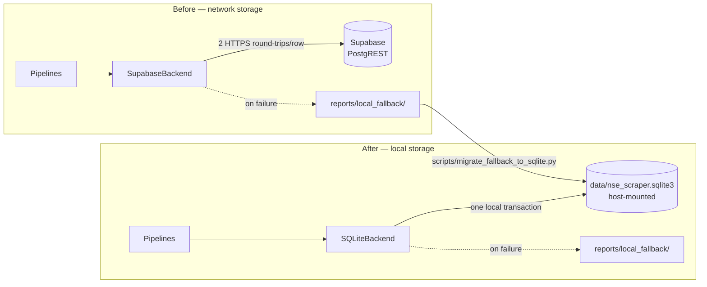

# Migration: Supabase → local SQLite

Completed 2026-09-06. This is the record of why the migration happened, what was moved,
how it was validated, and how to operate, inspect and recover the database now.

For the full system architecture see [ARCHITECTURE.md](ARCHITECTURE.md).

---

## 1. Why

The Supabase project host `vbqerqbllfwnyjsogbxl.supabase.co` stopped resolving in DNS on
**2026-07-26** and never came back (`getent hosts` returns nothing; general DNS on the same
machine resolves fine). From that day every write failed:

```
QUALITY stockanalysis_scraper FAILED items=123 min=95 db_ok=0 db_failed=63
RUN_STATUS FAILED afx_exit=0 stockanalysis_exit=2
```

Scraping was never the problem — 123 items a day were extracted correctly throughout.
Only storage was broken, for **43 consecutive days**.

SQLite removes the failure mode entirely: no network, no credentials, no external project
to expire. For a single-writer job producing ~64 rows a day it is the right size of tool.

## 2. What the data was migrated *from*

**Not from Supabase — it was unreachable.** The data was recovered from the failure path
that had been quietly preserving it.

`SupabaseBackend._write_local_fallback` appends every rejected payload to
`reports/local_fallback/<table>_fallback-<date>.jsonl`, and `scripts/run_daily_with_git.sh`
commits those files to git. So 43 days of rejected writes were sitting in the repository,
each line a **complete upsert payload** in exactly the shape the backend would have sent.

| Corpus | Files | Span | Payloads | Distinct tickers |
|---|---|---|---|---|
| `stockanalysis_stocks` | 43 | 2026-07-26 → 2026-09-06 | 2772 | 64 |
| `stock_data` | 2 | 2026-08-08, 2026-08-18 | 142 | 71 |

`stock_data` has only two days because `afx_scraper` has separately been unable to reach
`afx.kwayisi.org` from this host; those were the two days it got through.

### The replay recovered more than a copy would have

Each stored payload carries a `price_history` of length **1**, because the read-back that
would have grown the array failed too. Replaying the files **in date order** through the
live backend runs every payload past the real append-only-if-price-or-change-moved rule:

```
43 files x 1-point history  ->  64 rows holding 1691 history points
```

Most tickers ended with 29–32 dated points spanning 2026-07-26 → 2026-09-05. **That is more
history than Supabase itself ever held.**

The same applies to metrics. Only ~16 tickers are enriched per run (see the rotating window
in `ARCHITECTURE.md` §8.2), so any single day has partial `dividends_metrics` /
`profile_metrics` / `price_metrics`. Because the backend *omits* rather than *nulls* an
absent metrics column, folding many days accumulates the union:

| Column | Rows populated (of 64) |
|---|---|
| `overview_metrics` | 64 |
| `price_metrics` | 63 |
| `profile_metrics` | 62 |
| `performance_metrics` | 57 |
| `dividends_metrics` | 39 |

## 3. Old vs new architecture



Everything upstream of the backend is **unchanged**: cron, the git wrapper, Docker, the
runner script, both spiders, both pipelines' logic, the quality gate, and the report
formats. `scripts/run_daily_job.sh` and `scripts/run_daily_with_git.sh` were not modified
at all.

## 4. Schema

Canonical DDL: [`sql/sqlite/001_schema.sql`](../sql/sqlite/001_schema.sql). The runtime does
not read it — `SQLiteBackend._create_schema()` issues the same statements on every `open()`,
so a fresh database is created automatically. `tests/test_sqlite_backend.py` asserts the two
never drift apart.

```sql
CREATE TABLE stock_data (
    ticker_symbol TEXT PRIMARY KEY,   stock_name    TEXT NOT NULL,
    stock_price   REAL NOT NULL,      stock_change  REAL,
    scraped_at    TEXT NOT NULL,      created_at    TEXT NOT NULL,
    price_history TEXT NOT NULL DEFAULT '[]');

CREATE TABLE stockanalysis_stocks (
    ticker_symbol TEXT PRIMARY KEY,   company_name  TEXT NOT NULL,   rank INTEGER,
    stock_price   REAL,               stock_change  REAL,
    scraped_at    TEXT NOT NULL,      created_at    TEXT NOT NULL,   updated_at TEXT NOT NULL,
    overview_metrics TEXT, performance_metrics TEXT, dividends_metrics TEXT,
    price_metrics    TEXT, profile_metrics     TEXT,
    price_history TEXT NOT NULL DEFAULT '[]');
```

Type mapping and the reasons for each choice:

| Postgres / Supabase | SQLite | Why |
|---|---|---|
| `JSONB` | `TEXT` holding JSON | SQLite has no JSONB type. The JSON1 functions (`json_extract`, `json_array_length`) operate on TEXT, so queries are equivalent. |
| `TIMESTAMPTZ` | `TEXT` holding ISO-8601 | This is what was already being stored — the application has always written `.isoformat()` strings. |
| `DOUBLE PRECISION` | `REAL` | SQLite `REAL` is a 64-bit IEEE float; same precision. |
| GIN indexes on JSONB | *(dropped)* | No SQLite counterpart. At 64 rows they bought nothing. |
| `updated_at` trigger | set in the `ON CONFLICT DO UPDATE` clause | Avoids recursive-update surprises; same observable behaviour. |

`created_at` semantics differ per table, faithfully mirroring what each did before:

- `stockanalysis_stocks` — set on first insert, **never rewritten** (the Postgres column had
  `DEFAULT NOW()` and the upsert payload never included it).
- `stock_data` — refreshed on every write, because the Supabase payload *did* include
  `created_at`, so `ON CONFLICT UPDATE` overwrote it.

## 5. Running the migration

```bash
python3 scripts/migrate_fallback_to_sqlite.py --dry-run          # replay into a throwaway DB
python3 scripts/migrate_fallback_to_sqlite.py --report reports/migration/
```

| Flag | Effect |
|---|---|
| `--source-dir DIR` | fallback directory (default `reports/local_fallback`) |
| `--db-path PATH` | target database (default `data/nse_scraper.sqlite3`) |
| `--dry-run` | replay into a temporary database and report; the target is untouched |
| `--report DIR` | write a JSON validation report |
| `--reset` | empty the migrated tables first — **required** to re-run against a populated database |

The script replays through `SQLiteBackend`'s own upsert methods rather than writing its own
SQL, so the migration path and the runtime path cannot drift apart.

> **Re-running requires `--reset`.** The replay is append-based by design: it feeds every
> payload through the price-history rule. Starting again from the oldest file against a
> populated database would append the whole series a second time (2 points silently become
> 4). The script refuses a populated target unless `--reset` is given, which empties the
> two tables first and makes the result reproducible.

## 6. Validation performed

| # | Check | Result |
|---|---|---|
| 1 | Supabase schema inspected | `sql/001`, `sql/003` — the Supabase-era DDL, left untouched |
| 2 | Complete dataset determined | 2914 payloads across 45 files |
| 3 | SQLite schema created | both tables + indexes |
| 4 | All records migrated | 2772 → 64 rows; 142 → 71 rows; **0 write failures** |
| 5 | Record counts validated | db tickers == source tickers, 0 missing / 0 extra, rows == distinct tickers |
| 6 | Representative record | `DTK`: `dividendYield=4.67`, `dps=9.0`, `payoutFrequency=Annual`, `rank=15`, `founded=1946`, `tr1y=93.47` — matches the source line exactly |
| 7 | `price_history` validated | 1691 points; `DTK` holds 30 spanning 2026-07-26 → 2026-09-05 |
| 8 | Timestamps and keys | every `scraped_at` parses as ISO-8601; no empty `ticker_symbol` |
| 9 | Queryability | `json_extract` / `json_array_length` verified across the table |
| 10 | Runtime switched | only after all of the above |

Supabase data was **not** deleted or modified. The `SUPABASE_*` configuration and the
`SupabaseBackend` remain in place.

## 7. Database location and Docker persistence

```
<repo>/data/nse_scraper.sqlite3      # host
/app/data/nse_scraper.sqlite3        # container
```

The daily job is a one-shot container (`docker compose run --rm`), so anything written to
the container filesystem is destroyed when it exits. `deployment/docker-compose.yml` bind-
mounts the directory, exactly as it already did for `reports/` and `httpcache/`:

```yaml
environment:
  DB_BACKEND: sqlite
  SQLITE_DB_PATH: /app/data/nse_scraper.sqlite3
volumes:
  - ../reports:/app/reports
  - ../httpcache:/app/httpcache
  - ../data:/app/data
```

The container runs as `scraper` (uid 1000, `deployment/Dockerfile`), matching the host user
that owns `data/`, so the bind mount is writable. `data/` is created in the image too, so an
ad-hoc `docker run` without the volume still gets a working (ephemeral) database.

`data/.gitkeep` is committed so the directory exists in a fresh clone — **if the host
directory is missing, Docker creates it as `root` and the container cannot write to it.**

The `HEALTHCHECK` validates the selected backend and, for SQLite, that the database
directory is writable — catching a missing or read-only mount before a crawl silently sends
63 rows to the fallback file.

## 8. Backend selection

| Variable | Default | Notes |
|---|---|---|
| `DB_BACKEND` | `sqlite` | `sqlite` or `supabase` |
| `SQLITE_DB_PATH` | `data/nse_scraper.sqlite3` | relative to the working directory: repo root locally, `/app` in the container |
| `SUPABASE_URL` / `SUPABASE_KEY` / `SUPABASE_TABLE` | — | required only when `DB_BACKEND=supabase` |

Backends live in `nse_scraper/db/backends.py`; `create_backend()` selects one and
`SUPPORTED_BACKENDS` lists the valid names.

> **Gotcha.** `_stockanalysis_pipelines()` in `nse_scraper/spiders/stockanalysis_scraper.py`
> reads `DB_BACKEND` from the **environment at import time**. A `-s DB_BACKEND=...` on the
> Scrapy command line will not change which pipeline is installed; the environment variable
> will. It now tests against `SUPPORTED_BACKENDS` — while it tested `== "supabase"`,
> selecting any other backend installed no pipeline at all, and because both write counters
> then stayed at 0, the quality gate reported SUCCESS for a run that stored nothing.

## 9. How daily runs write now

Unchanged from cron down to the pipelines; only the last hop differs:

```
cron 09:00 → run_daily_with_git.sh → docker compose run --rm scraper-job
           → run_daily_job.sh → scrapy crawl <spider>
           → NseScraperPipeline / StockAnalysisPipeline
           → SQLiteBackend → data/nse_scraper.sqlite3
```

Per write: `SELECT price_history` → append an entry only if price or change moved → build
the `ON CONFLICT DO UPDATE SET` list **from the keys actually present** → one statement.
That last step is what preserves a view the run did not scrape.

First run after the migration:

```
QUALITY afx_scraper OK items=0 min=0 db_ok=0 db_failed=0
QUALITY stockanalysis_scraper OK items=123 min=95 db_ok=63 db_failed=0
RUN_STATUS SUCCESS
```

— the first `SUCCESS` since 2026-07-26.

## 10. Inspecting and querying

The `sqlite3` CLI is not installed on this host, so the examples use Python. If you have the
CLI, the same SQL works with `sqlite3 data/nse_scraper.sqlite3 "<query>"`.

```bash
python3 -c "
import sqlite3, json
c = sqlite3.connect('data/nse_scraper.sqlite3'); c.row_factory = sqlite3.Row
for r in c.execute('''SELECT ticker_symbol, stock_price,
                             json_extract(dividends_metrics, \"\$.dividendYield\") AS yield
                      FROM stockanalysis_stocks
                      WHERE yield IS NOT NULL ORDER BY yield DESC LIMIT 5'''):
    print(dict(r))
"
```

Useful queries:

```sql
-- how much history each ticker has
SELECT ticker_symbol, json_array_length(price_history) FROM stockanalysis_stocks ORDER BY 2 DESC;

-- one ticker's full price series
SELECT value FROM stockanalysis_stocks, json_each(price_history) WHERE ticker_symbol = 'DTK';

-- biggest companies
SELECT ticker_symbol, json_extract(overview_metrics, '$.marketCap') m
FROM stockanalysis_stocks ORDER BY m DESC LIMIT 10;

-- which views are missing for a ticker
SELECT ticker_symbol, dividends_metrics IS NULL, profile_metrics IS NULL
FROM stockanalysis_stocks WHERE ticker_symbol = 'SCOM';

-- staleness check
SELECT MAX(scraped_at), MAX(updated_at) FROM stockanalysis_stocks;
```

## 11. Failure and fallback behaviour

`reports/local_fallback/` was **kept**, unchanged in format. The reasoning matters:

- A local write is more reliable than a network write but **not infallible** — a full or
  read-only host volume, a permissions mismatch on the bind mount, `database is locked`, or
  a corrupt file all fail.
- More importantly, the fallback is what makes `db_upsert_failed` meaningful. Without it a
  storage failure would raise and abort the crawl instead of being counted, and the quality
  gate would lose its ability to detect "scraped fine, stored nothing".
- Keeping the format identical means one replay tool covers both the Supabase era and the
  SQLite era.

On failure the backend logs, appends the payload to
`reports/local_fallback/<table>_fallback-<date>.jsonl`, and returns `False`. The pipeline
turns that into `nse/db_upsert_failed`, and `DataQualityGate` fails the run when every write
failed. Behaviour is identical to before; only the cause of a failure has changed.

## 12. Backup and recovery

**Backup** — the database is a single self-contained file:

```bash
cp data/nse_scraper.sqlite3 backups/nse_scraper-$(date +%F).sqlite3
```

Do it while no crawl is running, or use SQLite's online backup API to get a consistent copy
under WAL. `data/*.sqlite3*` is gitignored (including `-wal` and `-shm`), so backups belong
outside git or in a separate archive.

**Recovery** — three independent paths, in order of preference:

1. Restore a file copy.
2. Rebuild from the committed fallback corpus:
   `python3 scripts/migrate_fallback_to_sqlite.py --reset --report reports/migration/`.
   This is why the JSONL files stay in git — they are an append-only, human-readable,
   version-controlled record of everything the scraper produced.
3. Re-scrape. Only `price` and `change` refresh daily for every ticker; the enriched views
   rotate, so full coverage takes ~4 days.

**Replaying a specific fallback file** into the current database:

```bash
python3 -c "
import json, sys; sys.path.insert(0, '.')
from nse_scraper.db.backends import SQLiteBackend
b = SQLiteBackend(db_path='data/nse_scraper.sqlite3'); b.open()
ok = sum(b.upsert_stockanalysis_stock(json.loads(l)) for l in
         open('reports/local_fallback/stockanalysis_stocks_fallback-2026-09-06.jsonl') if l.strip())
b.close(); print(ok, 'rows replayed')
"
```

## 13. Reports and GitHub publishing

**Unchanged.** `scripts/run_daily_with_git.sh` was not modified. It still stages and commits:

- `reports/run-*.log` (newest only)
- `reports/task-runner.log`
- `reports/stats/*.json`
- `reports/local_fallback/*.jsonl`

then `git pull --rebase --autostash` and pushes, logging `GIT_COMMIT_STATUS` and
`GIT_PUSH_STATUS`. The commit message still reads
`chore(log): daily scraper run <date> - <SUCCESS|FAILED>`.

The database is deliberately **not** committed: a binary rewritten on every run would bloat
history and conflict on the rebase-then-push step. The data remains recoverable from the
committed fallback JSONL, which is diffable and reviewable in a way a binary is not.

## 14. Rollback

Set `DB_BACKEND=supabase` in `.env`. No code change is needed — `SupabaseBackend` is intact
and still tested. The SQLite file is left alone and can be switched back to at any time.
